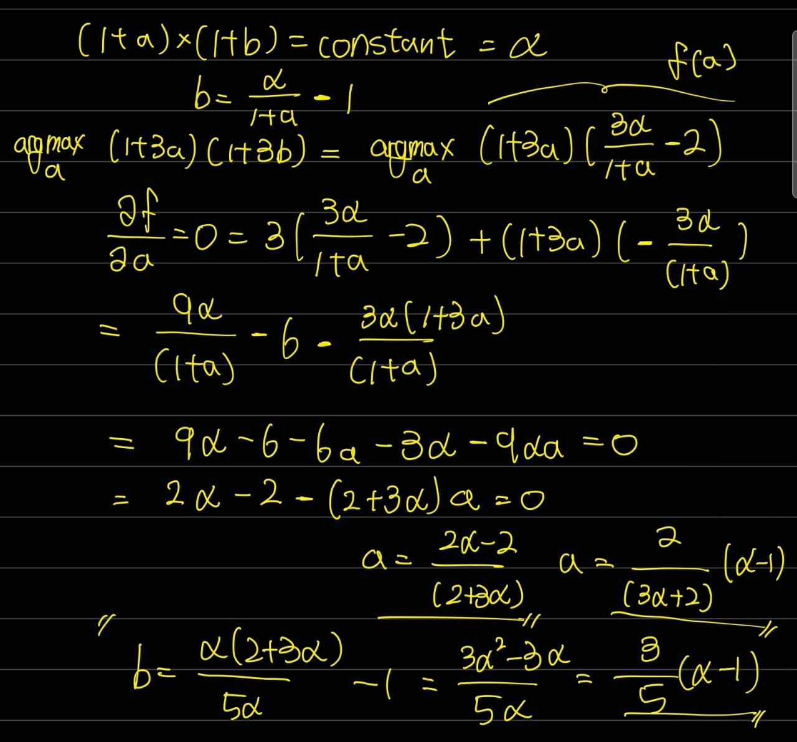

# 과연 너구리(NRGU)는 1000구리 일까?

저는 전문가도 아니고 주린이 입니다. 공부겸 **재미**로 적어봤으니 이상한 부분 있으면 알려주세요 ㅎㅎ

---

주변 친구들에게서 NRGU ( MicroSectors™ U.S. Big Oil Index 3X Leveraged ETNs ) 에 대한 추천을 받았었는데요.
1000달러 하던 주식이 현재 170 달러 까지 내려 왔기 때문에 지금 사면 1000 달러 까지 간다고 합니다.

3X Laverage ETP는 해당 종목들이 1% 오를 때, ETP는 3% 오릅니다. 1% 내릴 때, ETP는 3% 내리게 됩니다.

직관적으로는 별거 아니구나 라고 생각했는데 인터넷을 돌아다니다 보면 Leverage는 하지 말라고 하는 유튜브 들이 보여서 찾아보았고, ([슈카 유튜브](https://www.youtube.com/watch?v=VyJzRrBCaV0))

이러한 Leverage ETP는 자본을 잠식하는 경우가 있다는 것을 알았습니다. ([참고한 블로그](https://investank.org/2020/05/leverage-decay/))

이미 많이 떨어진 너구리 과영 자본 잠식의 영향을 얼마나 받았을지 궁금해졌습니다.

그래서 **가장 긍정적**으로 생각했을때, 얼마까지 올라갈 수 있을지 궁금해졌습니다.

이번 계산에서는 두가지 계산을 합니다.
1. 현재 주가에서 2012년 이후 max주가 까지 주식 가격까지 올라갔을 때의 NRGU max가격
2. 현재 주가에서 2020년 이후 max주가 까지 주식 가격까지 올라갔을 때의 NRGU max가격

2012년과 2020년을 특정한 이유는, 2020년 유가 하락에 의해서 많이 저평가 되었다고 생각하는 사람이 많은것 같아서 잡았습니다.

## 편한 계산을 위한 3가지 가정
- Leverage ETP는 등락을 반복하면 자본 잠식에 대한 영향을 받습니다. 자본 잠식을 최소화 하기 위해서 현재 시점부터 꾸준히 증가 한다고 가정합니다.
- ETP의 수수료는 존재하지 않는다고 가정합니다.
- 각 주식은 current value에서 부터 max 까지 n일동안 일정하게 증가한다고 가정합니다.

-----
## **일정**하게 증가한다고 가정하는 이유

- 실제로 maximization 하는 증가는 아니지만 계산하기 편하기 때문.

이로 인해서 충분히 오차가 생길 수 있다. 증가하는 방식에 따라서 값이 차이 날 수 있다.

------
## NRGU의 구성

Index Constituents [pdf](https://44b2e8ed-df1d-4d39-aeb7-c73ef59c9b98.filesusr.com/ugd/c95fca_5d0758d2bfd34d108dd6422f10481c2e.pdf)

|Ticker|Name|Weight|
|---|---|---|
|COP| ConocoPhillips |10%|
|CVX| Chevron Corp |10%|
|EOG| EOG Resources |10%|
|HES| Hess |10%|
|MPC| Marathon Petroleum |10%|
|OXY| Occidental Petroleum |10%|
|PSX| Phillips 66 |10%|
|PXD| Pioneer Natural Resources |10%|
|VLO| Valero Energy |10%|
|XOM| Exxon Mobil |10%|

------
## NRGU - data

from 2020 to 2021

|Ticker|Name|Max(2012-)|Max(2020-)|Min(2020-)|Current(3/7/21)|
|---|---|---|---|---|---|
|COP| ConocoPhillips            |85.73  |65.7   |26.84  |58.34  |
|CVX| Chevron Corp              |130.55 |121.01 |59.39  |109.0  |
|EOG| EOG Resources             |128.94 |86.27  |34.24  |74.58  |
|HES| Hess                      |101.10 |69.90  |30.69  |75.04  |
|MPC| Marathon Petroleum        |82.29  |68.01  |18.95  |57.32  |
|OXY| Occidental Petroleum      |100.11 |45.90  |9.13   |31.23  |
|PSX| Phillips 66               |123.34 |119.70 |46.66  |87.35  |
|PXD| Pioneer Natural Resources |229.81 |153.35 |61.76  |163.59 |
|VLO| Valero Energy             |121.20 |96.89  |38.61  |79.03  |
|XOM| Exxon Mobil               |102.41 |69.14  |32.62  |60.93  |
|NRGU| MicroSectors™ U.S. Big Oil Index 3X Leveraged ETNs | 1119.60| 734.11 |44.27| 170.44|

------
## 측정 결과 ( [calc.py](calc.py) )

## heighest stock prices after 2012

- 각각의 Constituents들이 '2012년 이후 중 가장 높았던 주가'까지 일정하게 증가한다고 가정하고 계산

|Days|Increase|NRGU|
|---|---|---|
|1|1.641574|498.489826|
|2|1.267916|554.527845|
|4|1.123408|600.812444|
|8|1.059331|632.000759|
|16|1.029102|650.435548|
|32|1.014414|660.515446|
|64|1.007173|665.794625|
|128|1.003578|668.497328|
|256|1.001787|669.864897|

## heighest stock prices after 2020

- 각각의 Constituents들이 '2020년 이후 중 가장 높았던 주가'까지 일정하게 증가한다고 가정하고 계산
 
|Days|Increase|NRGU|
|---|---|---|
|1|1.164931|254.772734|
|2|1.076842|258.079214|
|4|1.037114|259.992206|
|8|1.018241|261.025235|
|16|1.009043|261.562637|
|32|1.004502|261.836801|
|64|1.002246|261.975282|
|128|1.001122|262.044876|
|256|1.000561|262.079761|

---
## Result

- 지금부터 안전하게 NRGU에 있는 주식들이 일정하게 증가하여 '2012년 이후 중 가장 높았던 주가' 까지 도달한다면 **670**달러까지 돌파할 가능성이 있다고 생각한다.
- 또한, '2020년 이후 중 가장 높았던 주가' 까지 도달한다면 **262**달러까지 돌파할 가능성이 있다고 생각한다.

- 하지만, **자본 잠식**이 일어나기 전에 도달해야 한다는 risk를 안고 있음을 잊으면 안된다. 
NRGU 주가가 떨어질 때 마다 해당 목표치가 점점 줄어든다고 생각해야 된다고 본다.

- 1000구리에 도달하기엔 힘들것 같고, 자본이 덜 잠식 되고 모두 record high를 뚫어야만 1000구리까지 가능하지 않을까 생각한다.

---
## To-do

1. 현재는 Leverage 3X 일 때의 증가량을 일정하게 잡고 계산했지만, 아래의 equation을 이용하면 max값을 조금 더 정확하게 approximation 할 수 있을 것 같다.
